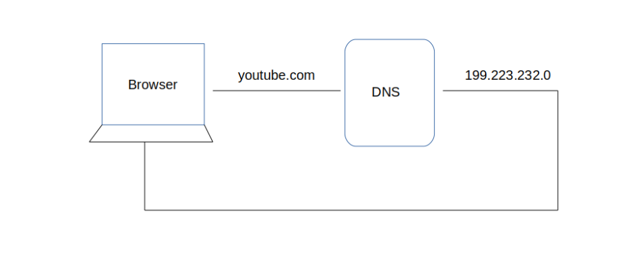

# Pesto Week-1 Assignment 1.1

## When a user enters an URL in the browser, how does the browser fetch the desired result ? Explain this with the below in mind and Demonstrate this by drawing a diagram for the same.

- Browser checks the cache for DNS record to find the corresponding IP address of the URL

- If the requested URL is not in the cache, ISP's DNS server initiates a DNS query to find the IP address of the server the hosts the URL

- Rhe browser initiates a TCP connection with the server

- The browser sends a HTTP request to the webserver

- The server handles the request & sends back a response

- The server sends out an HTTP response

- The browser displays the HTML contents

## What is the main functionality of the browser?

- The main functions of web browser is to fetch or retrieve informative resources from World Wide Web to the client/ user on demand, translate those files received from web server and display those content to the user and allow the client /user to access all other relevant resources & information via hyperlinks.

## High Level Components of a browser:
The browser's main components are"

1. The user interface:  this includes the address bar, back/forward button, bookmarking menu, etc. Every part of the browser display except the window where you see the requested page.

2. The browser engine: marshals actions between the UI & rendering engine

3. The rendering engine: responsible for displaying requested content. If the requested content is HTML, the rendering engine parses HTML & css & displays the parsed content on the screen

4. Networking: for network calls such as HTTP requests using different implementations for different platform behind a platform independent interface.

5. UI backend: used to drawing basic widgets like combo boxes & windows. This backed exposes a generic interface that is not platform specific. Underneath it uses operating system user interface methods

6. Javascript interpreter: Used to parsee & execute Javascript code.

7. Data Storage: This is presistence layer.The browser may need to save all sorts of data locally such as cookies,Browser also support storage mechanisms such as localStorage,indexDB, WebSQL & FileSysytem

Chrome can run multiple instances of rendering engine:one for each tab.Each tab  runs in a separate process.

## Rendering engine and its use.

The responsibility of the rendering engine is well.. Rendering, that is display of the requested contents on the browser screen

By default the rendering engine can display HTML & XML documents & images. It can display other types of data via plug-ins or extension; for example, displaying PDF documents using a PDF viewer plug-in & displaying HTML & images that are formatted using CSS.

## Parsers (HTML, CSS, etc):

So we have HTML content at the beginning which goes through a process called tokenization, tokenization is a common process in almost every programming language where code is split into several tokens which are easier to understand while parsing. This is where the HTML's parser understands which is the start and which is the end of the tag, which tag it is and what is inside the tag.

html tag starts at the top and then the head tag starts before the html ends so we can figure out that the head is inside html and create a tree out of it. Thus we then get something called a parse tree which eventually becomes a DOM tree as shown in the image below:

DOM tree is what we access when we do document.getElementById or document.querySelector in JavaScript.

Just like HTML, CSS goes through a similar process where we have the CSS text and then the tokenization of CSS to eventually create something called a CSSOM or CSS Object Model.

This is what a CSS Object Model looks like:

## Script Processors:

The model of the web is synchronous. Authors expect scripts to be parsed and executed immediately when the parser reaches a 
`<script>` tag. The parsing of the document halts until the script has been executed. If the script is external then the resource must first be fetched from the network - this is also done synchronously, and parsing halts until the resource is fetched. This was the model for many years and is also specified in HTML4 and 5 specifications. Authors can add the "defer" attribute to a script, in which case it will not halt document parsing and will execute after the document is parsed. HTML5 adds an option to mark the script as asynchronous so it will be parsed and executed by a different thread.

## Tree construction

While the DOM tree is being constructed, the browser constructs another tree, the render tree. This tree is of visual elements in the order in which they will be displayed. It is the visual representation of the document. The purpose of this tree is to enable painting the contents in their correct order.

Firefox calls the elements in the render tree "frames". WebKit uses the term renderer or render object.

## order of script processing

1. Plain script elements: executes in o\rder any pending CSS, block rendering until complete

2. Defer: This Boolean attribute is set to indicate to a browser that the script is meant to be executed after the document has been parsed, but before firing DOMContentLoaded.

3. Async : For classic scripts, if the async attribute is present, then the classic script will be fetched in parallel to parsing and evaluated as soon as it is available.

## Layout and Painting

The layout is where the elements are marked on the screen. The layout includes all the calculations and mathematics behind an element's position so it takes all the properties related to the position (height, width, position, top left right bottom, etc) from The Render Tree and places the elements on the screen.

After Layout, a Paint happens. Paint takes properties like color, background-color, border-color, box-shadow, etc. to paint the screen with colors.

After the paint, we see the content on the screen and the first time we see something other than a white screen is called 'First Paint'. The term First Paint is used in performance reports to show how long your website took to show something on the screen.